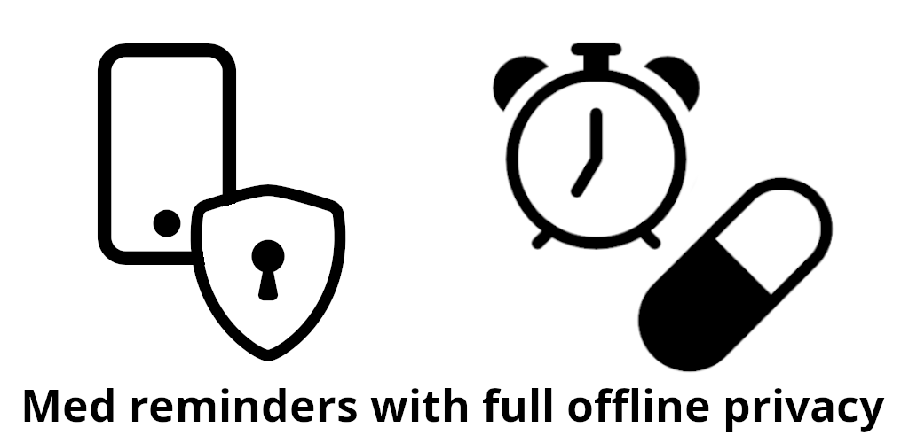
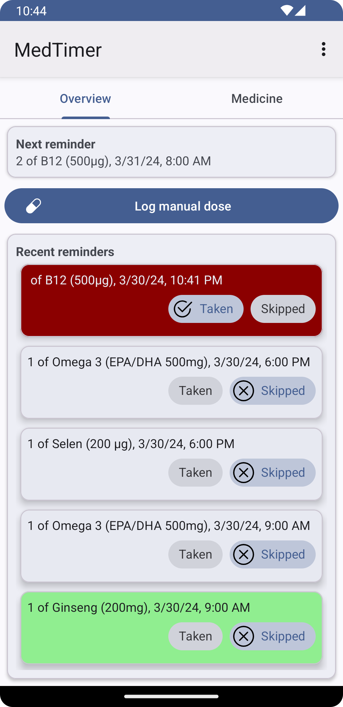
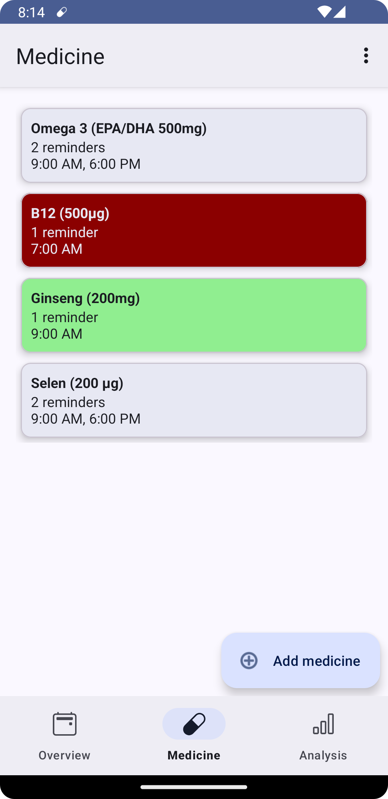
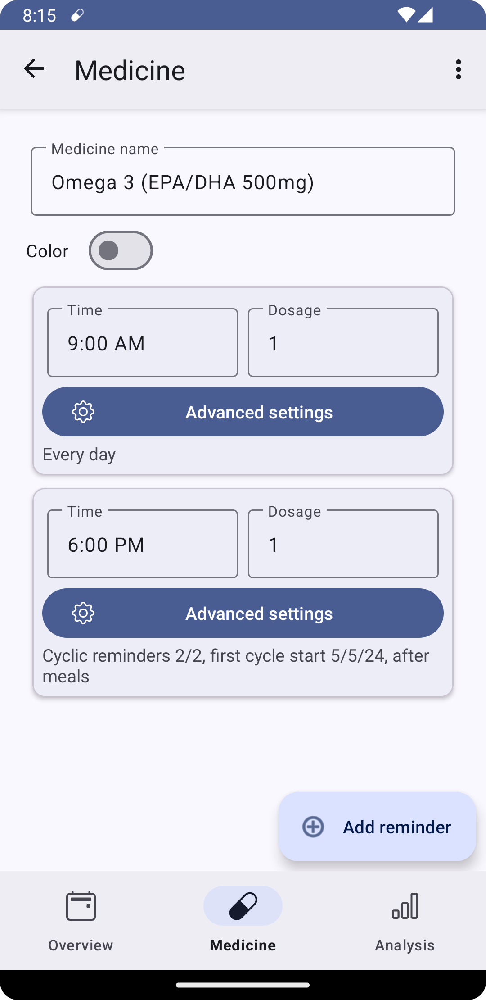
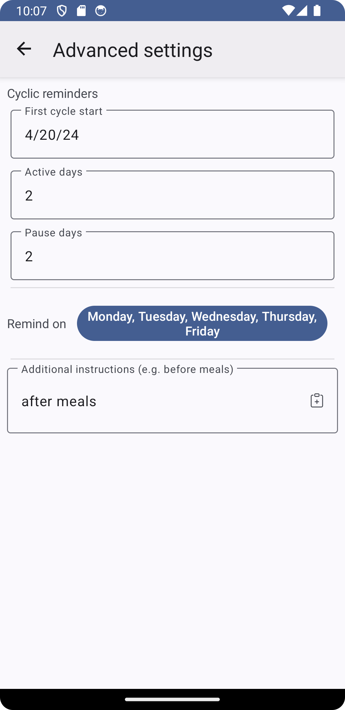

# MedTimer for Android

## Play store description

**Med reminders and history with full offline privacy**

  
  &nbsp;
   
  &nbsp;
  
  &nbsp;
  

Stay In Control of Your Medications with MedTimer

MedTimer is an open-source medication reminder app designed to help you manage your medications
effectively and with full control of your sensitive data.

Flexible & Personalized Reminders:

- Add unlimited medications with multiple daily reminders per medication.
- Customize reminders to fit your unique dosing schedule.

Simple & Secure Data Management:

- Confirm or dismiss reminders to record medication adherence accurately.
- Export your medication history as a CSV file for easy record-keeping or sharing with healthcare
  professionals.

Privacy & Offline Accessibility:

- All data is stored securely on your device, ensuring complete privacy and offline accessibility.
- No internet connection required – your medication reminders are always available.

MedTimer is a free app without adds.

Keywords: Medication reminder, pill reminder, medication adherence, health app, privacy, offline