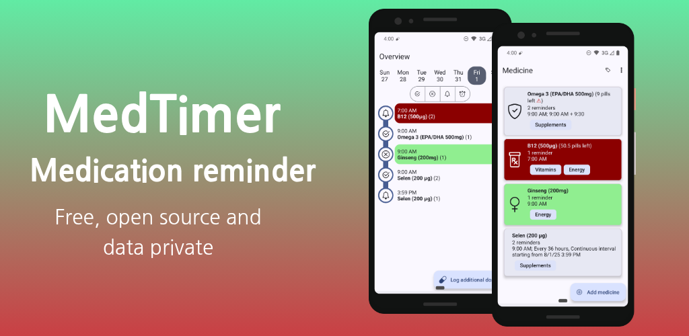
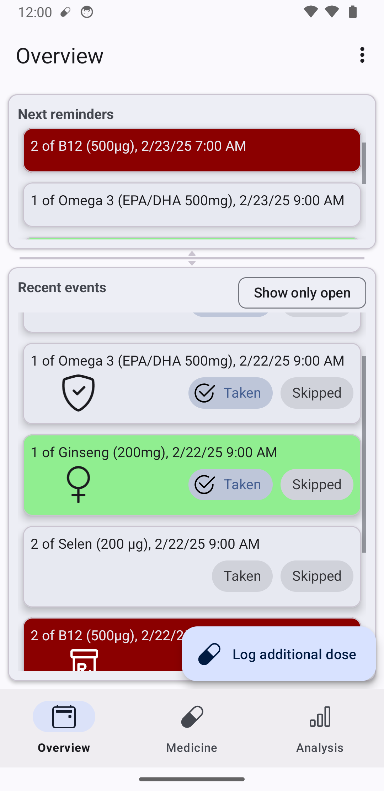
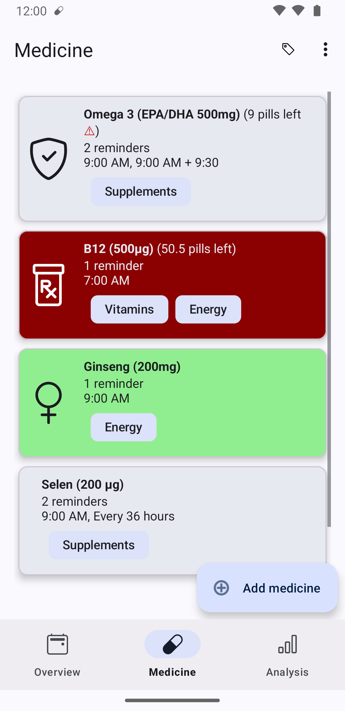
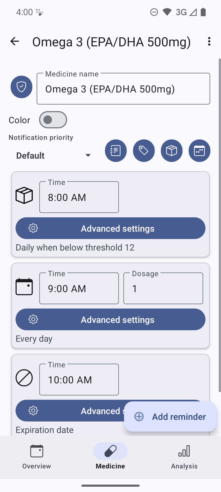
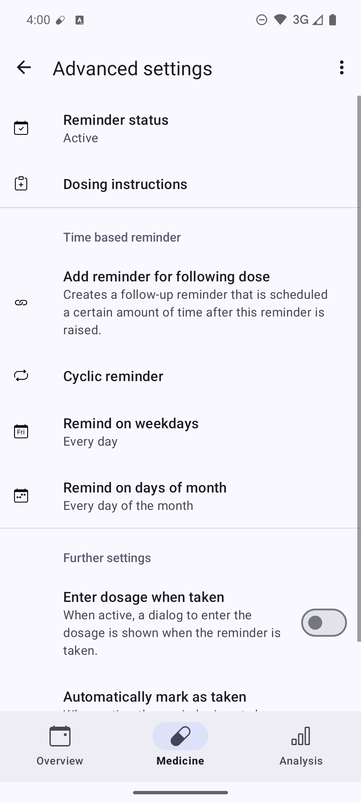
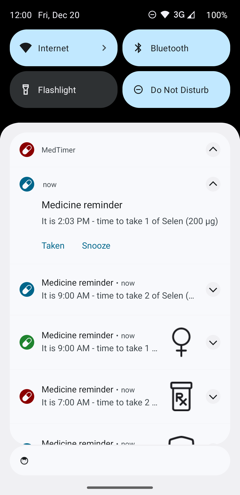
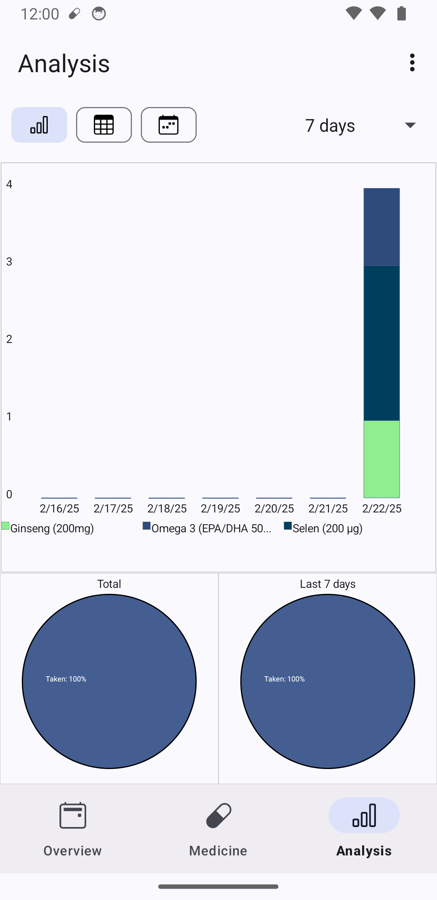
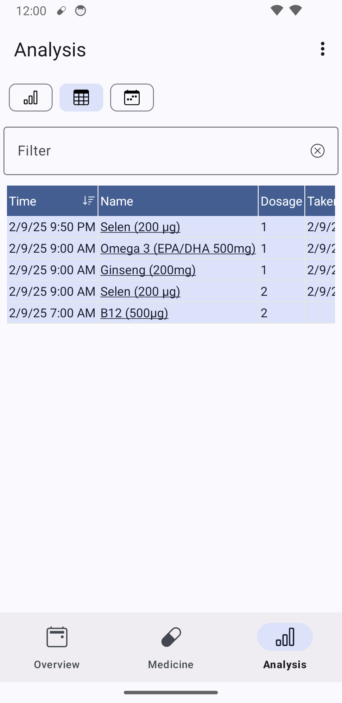
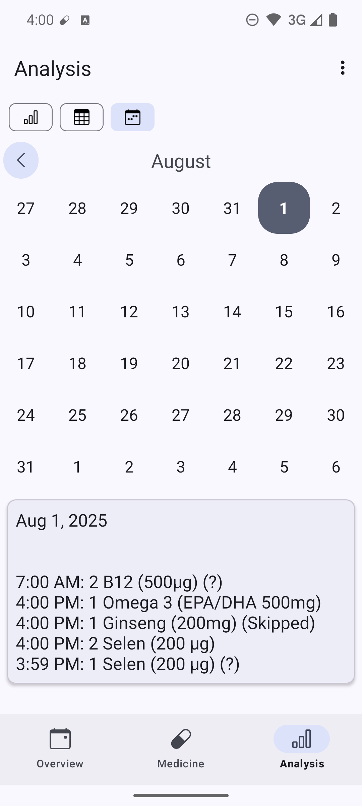

# MedTimer for Android

Or download the latest APK from
the [Releases Section](https://github.com/Futsch1/medTimer/releases/latest).

## Description

**Med reminders and history with full offline privacy**

  
  &nbsp;
   
  &nbsp;
  
  &nbsp;
  

  

  
  &nbsp;
  

  

Stay In Control of Your Medications with MedTimer

MedTimer is an open-source medication reminder app designed to help you manage your medications and
pills effectively and with full control of your sensitive data.

Flexible & Personalized Reminders:

- Manage unlimited medications with customizable reminders per medication (including simple defaults
  for daily reminders).
- Create flexible reminders with breaks and specific days (e.g. for birth control pills).
- Weekend mode: Delay reminders to a defined time on chosen days.
- Snooze notifications for later reminders.
- Add extra doses on the fly.

Simple & Secure Data Management:

- Confirm or dismiss reminders to record medication adherence accurately.
- Get an overview of past doses in a chart, tabular or calendar view.
- Export your medication history as a CSV file for easy record-keeping or sharing with healthcare
  professionals.
- Backup and restore your medication list as JSON file.

Privacy & Offline Accessibility:

- All data is stored securely on your device, ensuring complete privacy and offline accessibility.
- No internet connection required – your medication reminders are always available.

MedTimer is a free app without adds.

## Documentation

See the [use cases documentation](app/doc/UseCases.md) for more details on how to use the app and
the specific use cases it can satisfy.

## Contributing

See the [contributing guide](CONTRIBUTING.md) for details on how to contribute.

## Sponsor or support

If you like my work, you can [buy me a coffee](https://www.buymeacoffee.com/futsch1). Note
however that I will donate all the money I receive from your support to organizations supporting
open-source or open knowledge, like the Mozilla Foundation, or the Apache Software Foundation or
Wikimedia.

## Dependencies

MedTimer uses the following great open source libraries and dependencies:

- [Bootstrap icon](https://icons.getbootstrap.com/)
- [TableView](https://github.com/evrencoskun/TableView)
- [androidplot](https://github.com/halfhp/androidplot)
- [SimplyPDF](https://github.com/wwdablu/SimplyPDF)
- [AndroidX Preference eXtended](https://github.com/takisoft/preferencex-android)
- [Mockito](https://github.com/mockito/mockito)
- [Robolectric](https://github.com/robolectric/robolectric)
- [Calendar](https://github.com/kizitonwose/Calendar)
- [IconDialog](https://github.com/maltaisn/icondialoglib)
