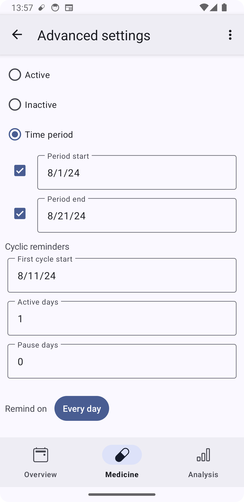

# Use cases for MedTimer

Find here some common use cases and how MedTimer should be setup to fulfill them properly.

## Birth control pills

If you are using birth control pills that require one week per cycle where no doses are required,
cyclic reminders in MedTimer can be setup to support that scheme.

Create a medicine and one reminder, there go to `Advanced settings`. In the `Cyclic reminders`
section, select the day when you would take the first pill in `First cycle start` (can be both a
future or a past date, the cycle will be calculated only based on that date and reminders would
also be active before that date). Now enter the number of days you have to take a pill (usually
in `Active days`. Finally, enter the number of days you are skipping the dose (usually 7) in
`Pause days`.

Should your cycle change, adjust the `First cycle start` to the new first pill's date.

## Tapering off a medicine

When tapering of a medicine, you would usually reduce the amount taken after a certain period. While
it is possible to manually change the amount, it is also possible to setup the scheme for
tapering of in advance.

For this, create one reminder per desired amount and set them active only in a certain time
period in the `Advanced settings`. If you set these periods adjacent to each other, only one
reminder with a given amount will be active at a time.

## Reminder every n weeks

If you have a reminder that should only notify every n weeks or days, you can use `Cyclic
reminders`. Go to `Advanced settings` and set `First cycle start` to one of the dates when the
reminder should notify. Set `Active days` to 1 (because you only want one reminder at that
certain day) and set `Pause days` to the number of days between two reminders. So if you want a
bi-weekly reminder, `Pause days` should be set to 13 (14 days - 1 day).

Note that weekly reminders can be setup much more easily by selecting the weekdays using the
`Remind on` button in the `Advanced settings`.

## Validate reminder settings

Especially when using cyclic reminders, it can be tricky to make sure that all reminders of a
medicine are setup correctly and will trigger the desired notification behavior. To validate if
the setup was correct, the calendar view of the medicine can be used. It is opened from the
calendar icon in the medicine screen next to `Notification priority`.

On this screen, you can see both past and future doses of a medicine. Days where a reminder will
be scheduled are marked with an underline. Select them to see the reminders that would notify on
that date at the bottom. Swipe to change the month.

## Different notification tones

## Modify events

## Additional dose with preset amount

## Export medication history
