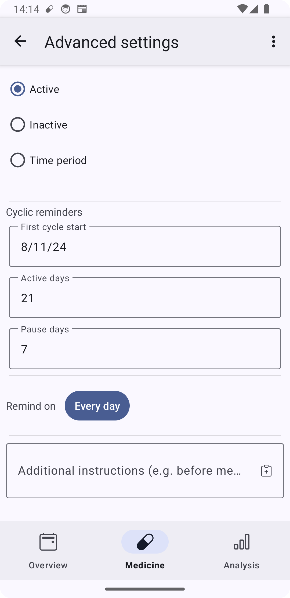
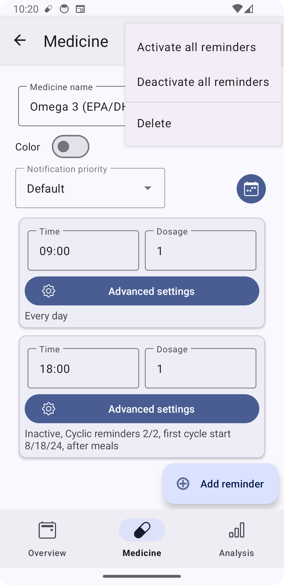
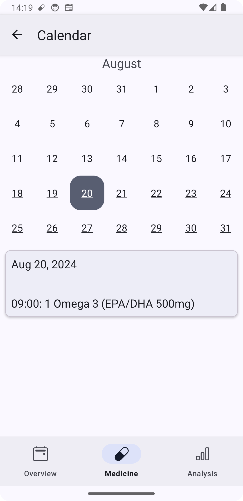
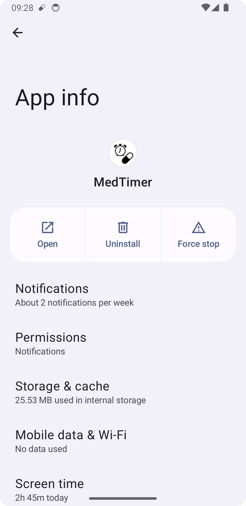
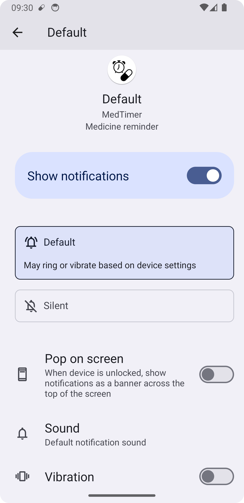
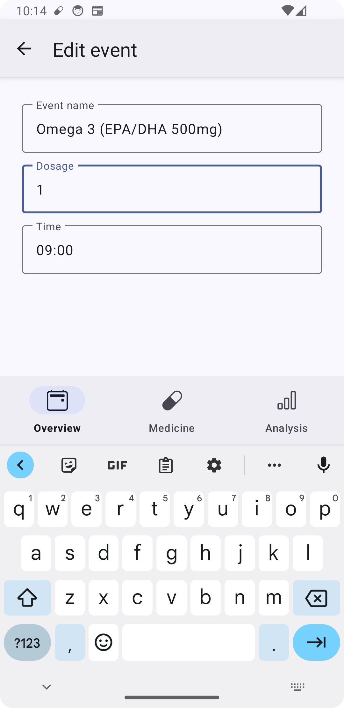
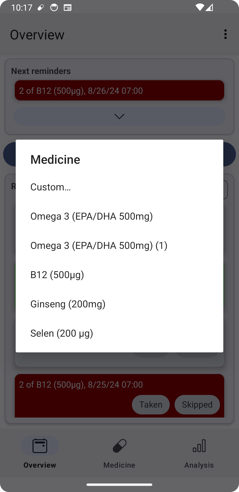
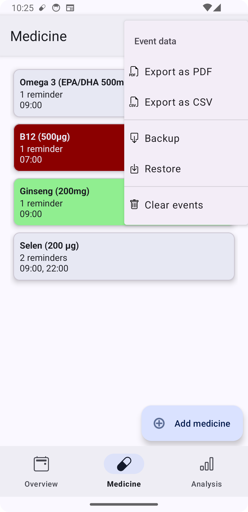

# Use cases for MedTimer

Find here some common use cases and how MedTimer should be setup to fulfill them properly.

## Birth control pills

If you are using birth control pills that require one week per cycle where no doses are required,
cyclic reminders in MedTimer can be setup to support that scheme.

Create a medicine and one reminder, there go to `Advanced settings`. In the `Cyclic reminders`
section, select the day when you would take the first pill in `First cycle start` (can be both a
future or a past date, the cycle will be calculated only based on that date and reminders would
also be active before that date). Now enter the number of days you have to take a pill (usually
in `Active days`. Finally, enter the number of days you are skipping the dose (usually 7) in
`Pause days`.

Should your cycle change, adjust the `First cycle start` to the new first pill's date.

## Tapering off a medicine

When tapering of a medicine, you would usually reduce the amount taken after a certain period. While
it is possible to manually change the amount, it is also possible to setup the scheme for
tapering of in advance.

For this, create one reminder per desired amount and set them active only in a certain time
period in the `Advanced settings`. If you set these periods adjacent to each other, only one
reminder with a given amount will be active at a time.

## Reminder every n weeks

If you have a reminder that should only notify every n weeks or days, you can use `Cyclic
reminders`. Go to `Advanced settings` and set `First cycle start` to one of the dates when the
reminder should notify. Set `Active days` to 1 (because you only want one reminder at that
certain day) and set `Pause days` to the number of days between two reminders. So if you want a
bi-weekly reminder, `Pause days` should be set to 13 (14 days - 1 day).

Note that weekly reminders can be setup much more easily by selecting the weekdays using the
`Remind on` button in the `Advanced settings`.

## Disable a medicine

To quickly disable a medicine completely, select the medicine from the `Medicine` screen, hit
the options menu icon on the top right and select `Deactivate all reminders`. This way, all
reminders will remain in the medicine with their configuration, but they will not create any
notifications. They can be re-activated the same way.

## Validate reminder settings

Especially when using cyclic reminders, it can be tricky to make sure that all reminders of a
medicine are setup correctly and will trigger the desired notification behavior. To validate if
the setup was correct, the calendar view of the medicine can be used. It is opened from the
calendar icon in the `Medicine` screen next to `Notification priority`.

On this screen, you can see both past and future doses of a medicine. Days where a reminder will
be scheduled are marked with an underline. Select them to see the reminders that would notify on
that date at the bottom. Swipe to change the month.

## Different notification sounds

It is possible to set different sounds to the reminders of two classes of medicines: Default
priority and high priority medicines. The priority can be changed in the `Medicine` screen.

Each priority has separate notification settings that can be accessed either via Android's app
settings and selection `Notifications` there.

As an alternative, access the notifications screen via the MedTimer settings screens using the
`Notification settings ...` menu items.

On the corresponding screen, you can configure the behavior of notifications in detail, turning
notifications on and off, assigning different sounds and controlling notification behavior. Note
that settings there have an effect on all medicines assigned to the corresponding category.

## Modify events

Events can be modified after they have been marked taken or skipped. The `Taken` or `Skipped`
status can be switched by selecting the corresponding buttons on the `Overview` screen.
Furthermore, details of the reminder can be changed as well by swiping the event to the right.
The event's name, the dosage and the reminded time can be edited. For additional doses, also the
date can be modified.

## Additional dose with preset amount

On the `Overview` screen, the `Log additional dose` screen asks to select the medicine and the
dosage to create an additional event. If you have a reoccurring dose with a fixed amount, you
can add this dose to the corresponding medicine and set it to `Inactive`. Inactive reminders
will show up in the medicine selection screen when creating an additional dose with their amount
in brackets. Select these entries to skip entering the amount manually.

## Export medication history

With MedTimer, it is possible to export the history of past doses either for your own reference
or to show to medical staff. MedTimer supports two different formats for medication history: CSV
and PDF. The CSV export is suited to be opened in a spreadsheet editor for further processing,
filtering and sorting and provides flexibility to handle the data. The PDF export generated a
file with a table of all past events that can be used to forward it to medical staff directly.

To export the history, open the options menu from the `Overview`, `Medicine` or `Analysis`
screen. Select `Event data` and choose the export format desired.

