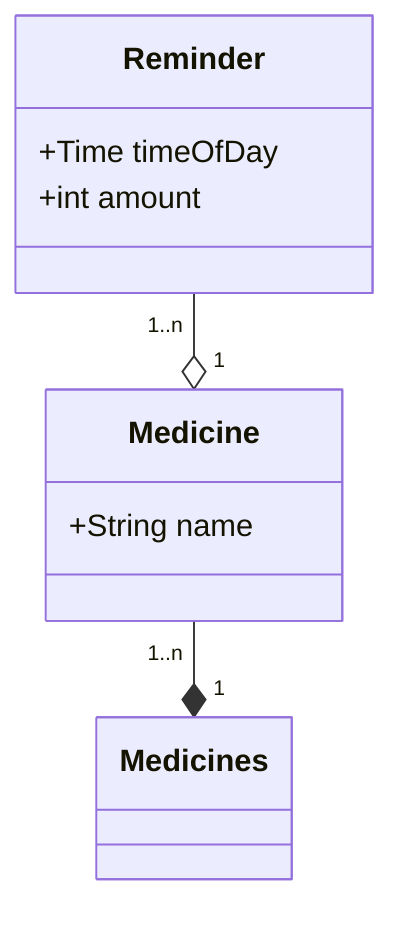

# Design

## Class design

```mermaid
classDiagram
    Medicine "1..n" --* "1" Medicines
    Reminder "1..n" --o "1" Medicine

    Medicine: +String name

    Reminder: +Time timeOfDay
    Reminder: +int amount
```

## Used modules

- [AlarmManager](https://developer.android.com/reference/android/app/AlarmManager)
- [Room](https://developer.android.com/training/data-storage/room/)