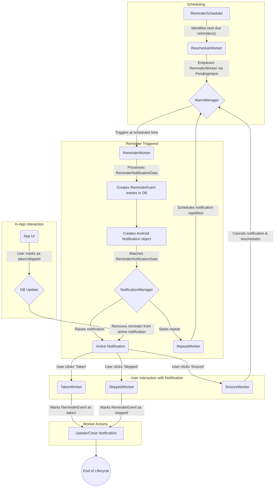

# Flow of reminders

This document outlines the flow of a reminder through the app and outlines the various cases that affect how a reminder is shown.

## General concept

All activities around reminders are performed using [Android workers](https://developer.android.com/reference/androidx/work/Worker). They execute
asynchronously on a background thread. The receiver class that receives intents to start workers and enqueues them in the WorkManager
is `ReminderWorkerReceiver`. This class also contains methods to enqueue new workers.

Information about reminders is passed using the class `ReminderNotificationData`. This class contains a list of reminder and reminder event IDs
(corresponding to the IDs in the Room database), the reminder [instant](https://developer.android.com/reference/java/time/Instant) and the notification ID.
Depending on the state of the notification, some of these fields are filled and some are not.

## Scheduling

As a first step, a reminder must be scheduled. The class `ReminderScheduler` performs this scheduling through its worker class `RescheduleWorker`. During
scheduling, the next due reminder (or several, if they trigger at the same time) is identified and the `ReminderWorker` is enqueued via a `PendingIntent`
using the [Android AlarmManager](https://developer.android.com/reference/android/app/AlarmManager).

For a scheduled reminder, `ReminderNotificationData` contains only the list of reminder IDs in the upcoming notification and the desired instant.

## Reminder flow

When a scheduled reminder is triggered, `ReminderNotificationWorker` will process the `ReminderNotificationData` and create a `ReminderNotification` object. In
the
creation process, reminder event database entries are created for each reminder. Furthermore, `ReminderNotification` will then contain the actual triplet of
objects containing all data required for the reminder event (`FullMedicine`, `Reminder` and `ReminderEvent`). From this data, an [Android Notification]
(https://developer.android.com/reference/kotlin/android/app/Notification) object is being created and raised via
the [NotificationManager](https://developer.android.com/reference/kotlin/android/app/NotificationManager).
The `ReminderNotificationData` is also attached to the `extra` field of the notification.
All actions associated to this notifications are again `PendingIntent`s that trigger different workers. The following workers can be invoked:

- `TakenWorker` and `SkippedWorker`: These workers change the state of the corresponding `ReminderEvent` and mark it either as taken or skipped.
  Additionally, the notification is closed or updated (depending on the number of reminders in the notification). This also marks the end of the
  reminder event life cycle. These workers do not require the full `NotificationData`, but require only the reminder event IDs that shall be marked as taken
  or skipped. If required, further data is extracted from the `Notification`'s extra.
- `SnoozeWorker`: This worker will cancel the pending notification and re-schedule the reminder. Reminder events stay in state raised.
- `RepeatWorker`: This worker will re-raise a notification after a certain amount of time to repeat the reminder. Reminder events stay in state raised.

When reminders are marked as taken or skipped using the app's overview while the notification is active, they are removed from the notification and the
notification is updated. Pending workers are not updated, but when they fire, these workers will filter out all reminders that are already processed.

