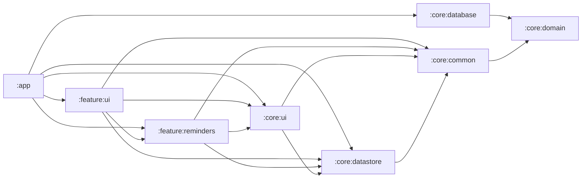

# Coding Guidelines — Kotlin / Android

**Audience:** all contributors.
**Stack:** Kotlin 2.3 (or newer), Android Gradle Plugin 9.2 (or newer), `compileSdk = 36`, `minSdk = 28`, JDK 21, Hilt 2.59, Room 2.8, Navigation 2.9, AndroidX,
Kotlinx Coroutines 1.9.

These conventions describe the multi-module Gradle build rooted at `settings.gradle.kts`.
For commands, see [`AGENTS.md`](../../AGENTS.md); for tests, see [testing.md](testing.md); for Compose, see [jetpack-compose.md](jetpack-compose.md).

## Enforcement (source of truth)

The rules below are mechanically checked — CI runs the same gates locally and on PRs.

- **Android Lint** (`app/build.gradle.kts`, `lint { abortOnError = true; warningsAsErrors = true }`) — every warning fails the build.
  Don't suppress without justification: if you must `@Suppress("RuleId")` or add a `tools:ignore`, include a comment explaining *why*.
- **SonarQube / SonarCloud** (project `Futsch1_medTimer` on `sonarcloud.io`) — secondary static analysis.
  New SonarQube issues introduced by a PR block merge.
- **Kotlin official code style** — line length **160**, four-space indent.
  The Android Studio / IntelliJ Kotlin formatter is the formatter of record; run **Reformat Code** before committing.
- **No new Java.**
  All new files are Kotlin.
  Existing Java is migrated opportunistically when touched substantially, not as an out-of-scope refactor.

## Naming

Follow [Kotlin coding conventions](https://kotlinlang.org/docs/coding-conventions.html), with these project-specific rules layered on top:

- Room entities end with **`Entity`**: `MedicineEntity`, `ReminderEntity`, `ReminderEventEntity`.
  Clean domain types in `core/domain/model/` carry no suffix: `Medicine`, `Reminder`, `ReminderEvent`.
- Role suffixes, consistently: `*ViewModel`, `*Repository` (interface), `*RepositoryImpl` (implementation), `*Fragment`, `*Activity`, `*Worker`, `*Receiver`,
  `*Service`.
- DAO interfaces end with **`Dao`**: `MedicineDao`.
- Mappers between layers live in `toModel/` / `toBackup/` sub-packages and are top-level functions named for the target (`toModel()`, `toEntity()`).
- Acronyms: two-letter acronyms stay uppercase (`IOStream`); three-or-more capitalize only the first letter (`HttpClient`, `XmlParser`).
- Backing properties use a leading underscore: `private val _state = MutableStateFlow(...)` exposed as `val state: StateFlow<...> = _state`.

## Architecture — MVVM + Hilt

medTimer follows the [recommended Android app architecture](https://developer.android.com/topic/architecture): a UI layer (Fragments + ViewModels) on top of a
data layer (Repositories + Room).
There is no separate domain layer today; complex domain rules live in `core/domain/` types and pure-Kotlin helpers.

**Dependency direction is inward only.**
Every arrow points toward `:core:domain` (the leaf); cycles are forbidden:

(Every non-leaf module also depends transitively on `:core:domain` — edges to it are omitted from the diagram to keep it readable.)

- **`:core:domain` is the lingua franca.**
  It has **no Android dependencies** and is consumed by every other module.
  Repository **interfaces** live here.
- **`:core:database` is depended on only by `:app`.**
  Feature modules never see Room or the `*Entity` types — they consume repository interfaces from `:core:domain`, and `:app` wires the `:core:database`
  implementations into Hilt at the binding site.
  This is what enforces the no-entity-leakage rule below.
- **Feature → feature dependencies are rare and one-directional.**
  Today only `:feature:ui` → `:feature:reminders` exists (the overview consumes reminder scheduling components).
  Before adding another, consider whether the shared code belongs in a `:core:*` module instead — feature-to-feature edges multiply quickly and turn into
  cycles.

### Domain models, not entities, outside `:core:database`

This is the load-bearing architectural rule.
**`*Entity` types from `:core:database` must not appear in any other module's API.**
Map at the boundary using the `toModel/` / `toEntity/` helpers in `:core:database` and depend on the clean types in `core/domain/model/` (`Medicine`,
`Reminder`, `ReminderEvent`, …).

- Repository **interfaces** live in `:core:domain` and speak in domain types (`Flow<List<Medicine>>`, not `Flow<List<MedicineEntity>>`).
- Repository **implementations** live in `:core:database` and do the entity ↔ model mapping.
- ViewModels, workers, exporters, and UI never import `MedicineEntity` etc.
  If you find yourself needing to, the mapper is missing — add it instead.

### Hilt (DI)

- `MedTimerApplication` is `@HiltAndroidApp`.
  `MainActivity` and any service receiving injected dependencies are `@AndroidEntryPoint`.
- ViewModels are `@HiltViewModel` with `@Inject constructor(...)`.
- Provider modules live in `app/src/main/java/com/futsch1/medtimer/di/`:
    - `DatabaseModule` — singleton Room database + `MedicineRepository`.
    - `DispatchersModule` — `@Dispatcher(MedTimerDispatchers.X)` qualified `CoroutineDispatcher` providers.
    - `CoroutineScopesModule` — `@ApplicationScope CoroutineScope`.
- Flavor-specific bindings (full vs foss `LocationModule`, `GeofenceRegistrar`) live in the flavor source sets under `app/src/full/.../di/` and
  `app/src/foss/.../di/`.
- New code injects via constructor (`@Inject`) on ViewModels and via field-injection (`@Inject lateinit var`) only on Android framework classes (Fragments,
  Receivers, Services) where Hilt can't reach the constructor.

### State holders

- ViewModels expose **immutable** state: `val state: StateFlow<UiState> = _state.asStateFlow()` (or backed by `private val _state`).
- One-shot events go through `SharedFlow` with `replay = 0`, collected from the UI with a `LifecycleEventEffect`-style scope.
- **No `LiveData` in new code.**
  Existing `LiveData` is migrated opportunistically when the file is touched substantially.

## Coroutines and Flow

Follow [Android coroutines best practices](https://developer.android.com/kotlin/coroutines/coroutines-best-practices).

- **Inject dispatchers** with the `@Dispatcher(MedTimerDispatchers.X)` qualifier — never reference `Dispatchers.IO`/`Default` directly.
  This is what makes tests deterministic with `StandardTestDispatcher` + `runTest`.
- Suspend functions are **main-safe**: they switch dispatchers internally with `withContext`, so callers never have to.
- **Don't use `GlobalScope`.**
  Long-lived work uses the injected `@ApplicationScope CoroutineScope`; UI-bound work uses `viewModelScope` or `lifecycleScope`.
- Expose `suspend fun` for one-shot calls and `Flow` for data streams.
- **Don't swallow `CancellationException`** — let it propagate.
  Catch specific exceptions (e.g. `IOException`), not `Throwable`.
- Public ViewModel APIs expose `StateFlow` (read-only); keep the `MutableStateFlow` private.

## Multi-module structure

Modules are listed in [`settings.gradle.kts`](../../settings.gradle.kts).
The current layout:

| Module               | Purpose                                                                                                                                                                                                        |
|----------------------|----------------------------------------------------------------------------------------------------------------------------------------------------------------------------------------------------------------|
| `:app`               | Application entry point, wiring, screens not yet extracted                                                                                                                                                     |
| `:core:common`       | Pure-Kotlin utilities (no Android dependencies where possible)                                                                                                                                                 |
| `:core:domain`       | Domain models and repository interfaces                                                                                                                                                                        |
| `:core:database`     | Room database, entities, repository implementations, mappers                                                                                                                                                   |
| `:core:datastore`    | DataStore-based preferences                                                                                                                                                                                    |
| `:core:ui`           | Shared **resources** (strings, drawables, themes, navigation graphs, XML layouts that cross features). Compose theme + reusable composables will land here too — see [jetpack-compose.md](jetpack-compose.md). |
| `:feature:reminders` | Reminder scheduling, notification processing                                                                                                                                                                   |
| `:feature:ui`        | Overview UI                                                                                                                                                                                                    |

### When to add a new module

Add a module when **both** are true: the code is genuinely reusable across the app **and** keeping it in its current location forces a circular or upward
dependency.
Don't split a feature into half a dozen sub-modules to chase build-cache wins — the boilerplate (Gradle file, Hilt aggregation, manifest, lint baseline)
outweighs the gain at this size.

When you do extract a module:

- New modules follow `:core:<name>` (cross-cutting infrastructure) or `:feature:<name>` (vertical slice).
- Set up the Gradle file from a sibling module of the same kind; don't invent a new pattern.
- Disable instrumented tests on modules that have none (`android.testInstrumentationRunner` + `androidTest { ... }`) — see commits `#1432` and `#1433` for the
  working pattern.

### Resource centralization (R-class gotcha)

The Android Gradle build uses `nonTransitiveRClass = true`.
This has two consequences worth memorizing:

- **All value resources (strings, drawables, themes) and assets live in `:core:ui`**, even if used by only one feature today.
  This avoids the broken visibility you get when one feature module tries to reach into another module's `R`.
- When you move a resource between modules, you must re-qualify every `R` reference to the **owning** module's `R` class (e.g.
  `com.futsch1.medtimer.core.ui.R.string.foo`).
  Layouts, menus, navigation graphs, and XML preferences may stay with their feature; values/assets do not.

## Flavor split — `full` vs `foss`

The `distribution` product-flavor dimension produces two builds:

| Flavor | GMS?                           | Source sets                                                              |
|--------|--------------------------------|--------------------------------------------------------------------------|
| `full` | Yes (`play-services-location`) | `app/src/full/`, `app/src/testFull/`, plus `feature:reminders/src/full/` |
| `foss` | No                             | `app/src/foss/` with no-op stubs                                         |

Discipline:

- The shared `app/src/main/` must compile against **both** flavors.
  Don't import GMS classes from `main/`; introduce an interface in `main/` (e.g. `GeofenceRegistrar`) and bind the implementation per flavor (
  `GmsGeofenceRegistrar` in `full/`, `NoOpGeofenceRegistrar` in `foss/`).
- Flavor-specific Hilt bindings go in `app/src/<flavor>/.../di/`.
- JVM unit tests that depend on GMS classes go in `app/src/testFull/` so they only run for the full flavor.
  Tests in `app/src/test/` must compile for both.
- `assembleDebug` builds **both** flavors — if it fails, your change broke one of them.

## Translations

User-facing strings are translated for every locale listed in `localeFilters` (see `app/build.gradle.kts`).
The community contributes translations via [Weblate](https://hosted.weblate.org/projects/medtimer/).

- When adding or changing a string in `values/strings.xml`, consider whether the other locales need an update.
  Weblate will pick up new keys; existing translations that no longer match the source should be flagged.
- Escape `'` as `\'`.
- Use `\n` for newline.
- Preserve positional placeholders (`%1$s`, `%2$d`); translators must not reorder them silently.
- Mark non-translatable strings with `translatable="false"`.

## Database — Room

Room infrastructure lives in `:core:database`.

- Schemas are emitted to `app/schemas/` and **committed**.
  They are the migration audit trail; review the schema diff in any PR that changes an entity.
- New migrations need a Room migration class and a corresponding `AutoMigration` only when the schema allows it.
  **Migration changes are an "Ask first" item — see [ai-assisted-development.md](ai-assisted-development.md).** They are user-visible and effectively
  irreversible once shipped.
- Repository interfaces in `:core:domain` are the seam: outside `:core:database`, depend on `MedicineRepository`, never on `MedicineRepositoryImpl` or any DAO.

## Sources

- Android
  Developers — [Guide to app architecture](https://developer.android.com/topic/architecture), [Modern app architecture](https://developer.android.com/topic/architecture/intro/modern-app-architecture), [Android coroutines best practices](https://developer.android.com/kotlin/coroutines/coroutines-best-practices), [Guide to app modularization](https://developer.android.com/topic/modularization), [Save data in a local database using Room](https://developer.android.com/training/data-storage/room) (
  2025–2026).
- [Kotlin coding conventions](https://kotlinlang.org/docs/coding-conventions.html) — JetBrains, 2025.
- Android Developers — [Hilt for Android](https://developer.android.com/training/dependency-injection/hilt-android)
  and [Hilt and Jetpack integrations](https://developer.android.com/training/dependency-injection/hilt-jetpack) (2025).
- [Now in Android](https://github.com/android/nowinandroid) — Google's reference app for modularization and architecture patterns.

_Last reviewed: 2026-05-26 · Kotlin 2.3 / AGP 9.2 / Hilt 2.59 / Room 2.8._
