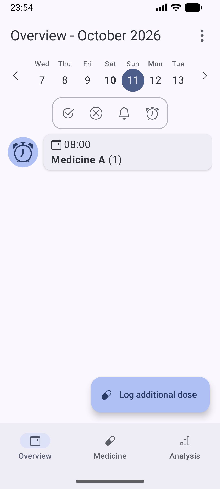

# Getting started

This guide is currently available in English only.

MedTimer stores medicines and reminders separately. Add a medicine, then add a reminder for it. A medicine without a
reminder does not schedule one.

This example uses fictional **Medicine A**, dosage **1**, and a daily reminder at **08:00**. These values explain the
app; they are not medical advice.

1. Open **Medicine**, choose **Add medicine**, enter **Medicine A**, and confirm.
2. On the medicine screen, choose **Add reminder**. Choose **Time based reminder** for a specific clock time; interval reminders instead repeat after a time interval. Choose the type that matches your intended setup; MedTimer does not recommend a medical schedule.
3. Enter dosage **1**, set the time to **08:00**, and choose **Create reminder**.
4. Open **Overview** and check the next scheduled date, medicine, dosage, and time. If 08:00 has passed today, look at
   tomorrow.

   

An upcoming entry is a schedule preview, not confirmation that Android delivered a notification.

[Help contents](README.md)
